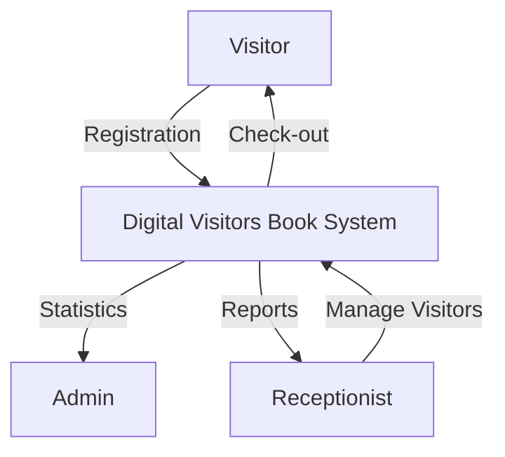
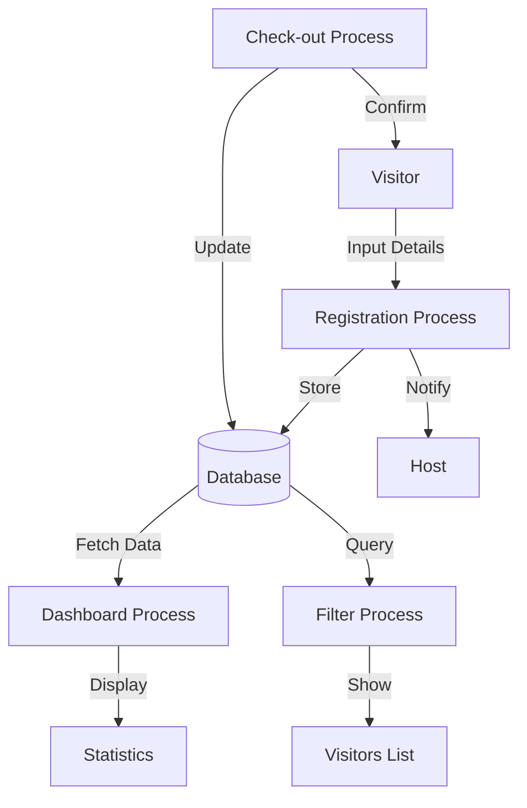
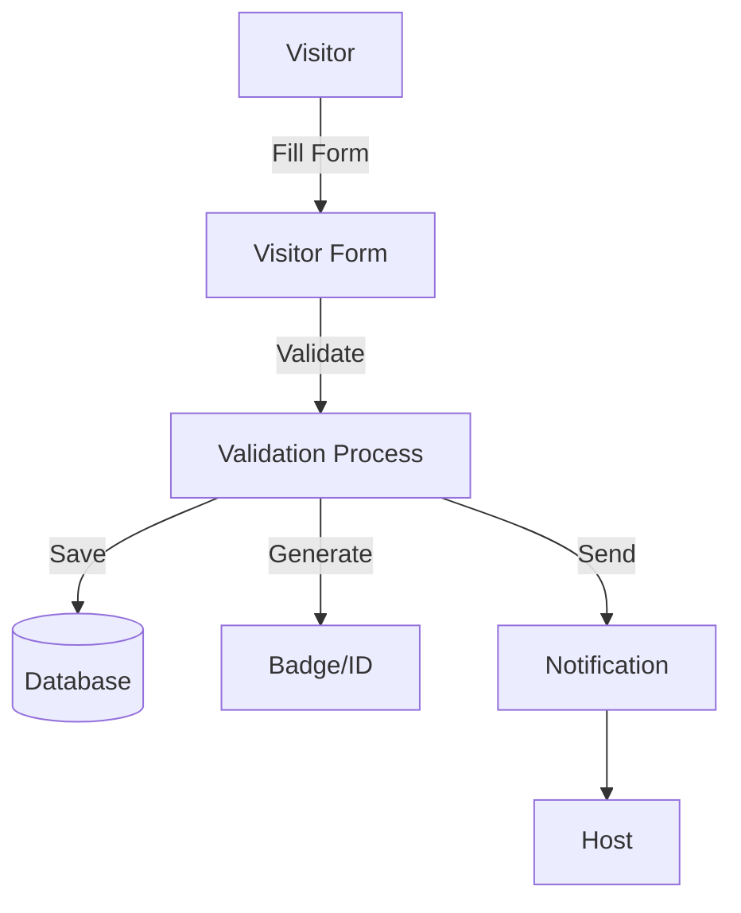

# Digital Visitors Book 📝

A modern, web-based visitor management system that helps organizations efficiently track and manage visitors. This application provides real-time visitor tracking, comprehensive reporting, and an intuitive user interface.

## 📸 Screenshots

### Registration Form

*Visitor registration form with input validation*

### Visitors List

*Today's visitors list with filtering options*

### Dashboard

*Analytics dashboard showing visitor statistics*

## 🔄 Data Flow Diagrams

### Context Level DFD


### Level 0 DFD


### Level 1 DFD - Registration Process


## ✨ Features

- **Real-time Visitor Management**
  - Quick visitor registration
  - Automatic check-in and check-out system
  - Contact information storage
  - Purpose of visit tracking

- **Smart Dashboard**
  - Today's visitor statistics by default
  - Interactive charts showing visitor trends
  - Active visitors counter
  - Average daily visitors analytics

- **Advanced Filtering**
  - Filter visitors by date, month, and year
  - Quick reset to current day's data
  - Comprehensive visitor history

- **Modern UI/UX**
  - Clean and intuitive interface
  - Responsive design for all devices
  - Easy navigation between features
  - Status indicators for active/completed visits

## 🛠️ Tech Stack

- **Frontend**
  - React.js
  - React Router for navigation
  - Chart.js for analytics visualization
  - Modern CSS with responsive design

- **Backend**
  - Python with Flask
  - RESTful API architecture
  - SQLite database
  - JSON data handling

## 🚀 Getting Started

### Prerequisites

- Node.js (v14 or higher)
- Python (v3.8 or higher)
- npm or yarn package manager

### Installation

1. **Clone the repository**
   ```bash
   git clone [your-repository-url]
   cd Digital-Visitors-Book
   ```

2. **Set up the Frontend**
   ```bash
   cd frontend
   npm install
   ```

3. **Set up the Backend**
   ```bash
   cd backend
   pip install -r requirements.txt
   ```

### Running the Application

1. **Start the Backend Server**
   ```bash
   cd backend
   python app.py
   ```
   The server will start at `http://localhost:5000`

2. **Start the Frontend Development Server**
   ```bash
   cd frontend
   npm start
   ```
   The application will open at `http://localhost:3000`

## 📱 Usage

1. **Visitor Registration**
   - Navigate to the registration page
   - Fill in visitor details (name, contact, purpose, etc.)
   - Submit to create a new visitor entry

2. **Viewing Visitors**
   - Access the visitors list page
   - View all current day's visitors by default
   - Use date filters to view historical data
   - Check-out visitors when they leave

3. **Dashboard Analytics**
   - View today's statistics on the dashboard
   - Monitor active visitors
   - Track visitor trends through charts
   - Filter data by specific dates

## 🔐 Security

- Secure data handling
- Input validation
- Protected API endpoints
- Safe data storage practices

## 🛣️ Project Structure

```
digital-visitors-book/
├── frontend/
│   ├── src/
│   │   ├── components/
│   │   ├── App.js
│   │   └── index.js
│   └── public/
└── backend/
    ├── app.py
    └── requirements.txt
```

## 💡 Contributing

Contributions are welcome! Please feel free to submit a Pull Request.

## 📜 License

This project is licensed under the MIT License - see the LICENSE file for details.

## 🙏 Acknowledgments

- React.js team for the amazing frontend framework
- Flask team for the lightweight backend framework
- Chart.js for beautiful data visualization
- All contributors and supporters of this project

## 📝 Note About Screenshots

To add your own screenshots:
1. Create a `screenshots` directory in your frontend directory
2. Take screenshots of your application:
   - Registration form
   - Visitors list with filters
   - Dashboard with charts
3. Save the screenshots in PNG format
4. Update the image paths in this README

---

Made with ❤️ for efficient visitor management
